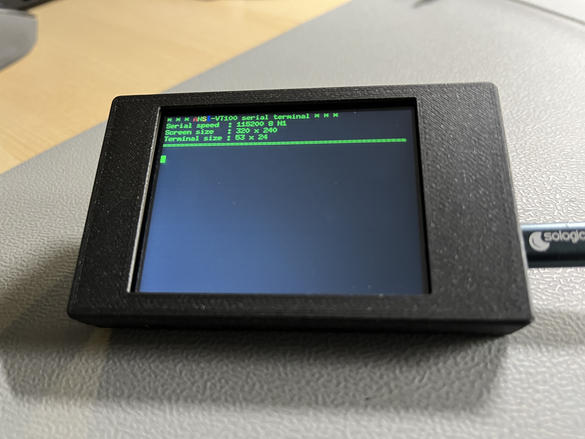
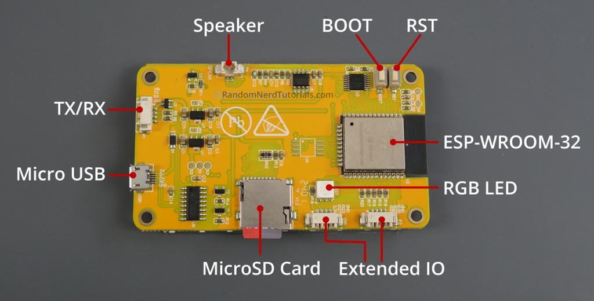
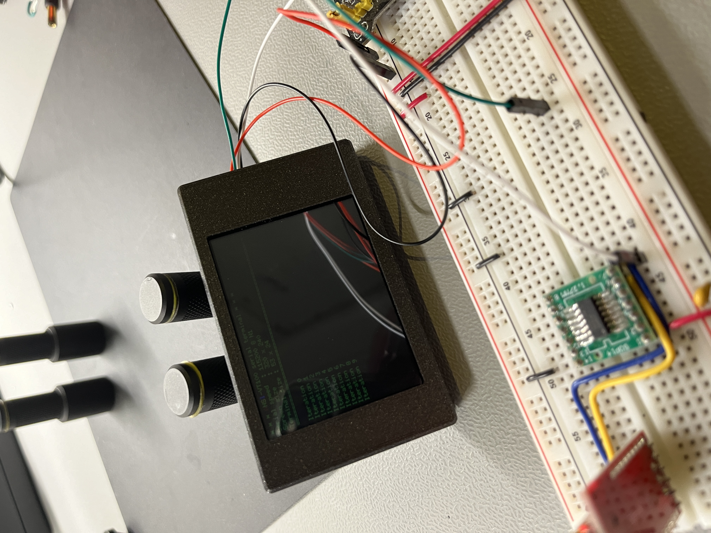
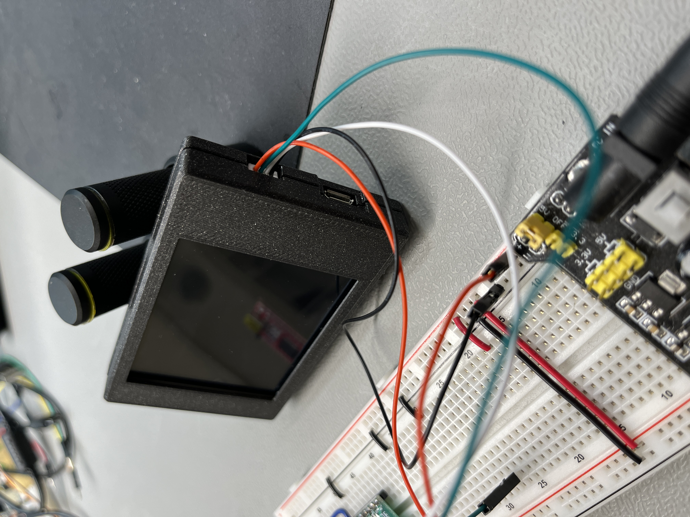

# Cheap Yellow Display / ANSI-VT100 serial terminal
This mini-project sets up a Cheap Yellow Display as a ANSI-VT100 serial terminal. The terminal displays serial data from a microcontroller without the use of a PC, very convenient.

## Requirements
1. An example display can be found at [ESP32-2432S028](https://www.amazon.nl/dp/B0CG2WQGP9?ref=ppx_yo2ov_dt_b_fed_asin_title). Above the USB-micro connector on the left, there is a 4-pin Rx/Tx connector thas also breaks out Vin/Gnd. The example display ships with the required cables to connect to it. Perfect.

2. Some kind of case. I printed [this case](https://www.printables.com/model/685845-enclosure-for-sunton-esp32-2432s028r-cheap-yellow-) in PLA, which has the proper opening for the Rx/Tx connector.
3. You need to replace the two small resistors right next to the Rx/Tx connector with a small piece of wire (like from a resistor, just 2mm), or a replacement 0-ohm resistor. I wasn't able to create reliable serial connections with the onboard 100Ohm! resistors; the replacements work reliably.
4. Replace this line in the '.pio/libdeps/CYD/FabGL/src/network/ICMP.cpp' file:
    -  #include "WiFiGeneric.h", with
    - #include "\<path to user homefolder\>/.platformio/packages/framework-arduinoespressif32/libraries/WiFi/src/WiFiGeneric.h"

    or face errors during compilation. This is an issue with the FabGL library.

## Usage
Using the supplied cable connected to JST connector P1 (Rx/Tx), connect
- VIN (RED cable) to a 5 volt power supply
- GND (Black cable) to common ground of the supply and your microcontroller
- RX (White cable) to the Tx PIN of your microcontroller. The RX pin is 3.3 volt, but also 5 volt tolerant.
- Set serial connection parameters on your microcontroller to 115200 baud, 8N1 (8 data bits, No parity bit, 1 stop bit) 

